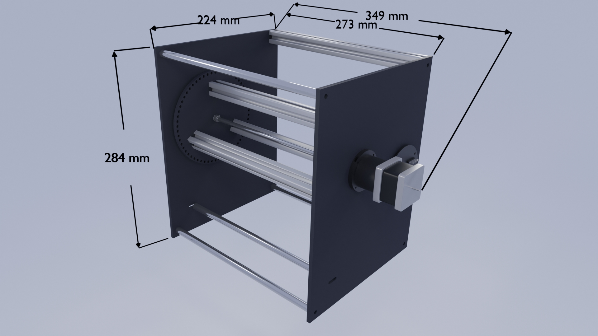

# SplitFlap

Project : 

Installation for photographer exhibition Isabelle Le Minh. Design & production by Olivier Bienz and Martin De Bie for six machines.

## list

plans : .dxf et .svg \
`_mod/_exports/_plans`

pcb design : schematic, layout and gerber \
`_pcb/split_falp`

programme : \
two easy code to set motorSpeed and calibrate steps.